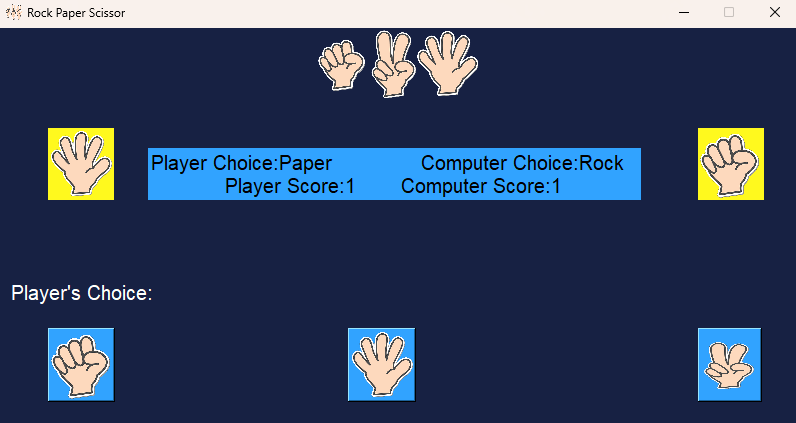

# Rock Paper Scissors Game

This is a simple Rock Paper Scissors game created using Python and the Tkinter library for the graphical user interface (GUI). The game allows a player to compete against the computer with random move generation. I did this project in my 12th grade.

## Features
- **User-friendly GUI**: Built with the Tkinter library.
- **Single-player mode**: Play against the computer.
- **Score Tracking**: Keeps track of wins, losses, and draws.

## Screenshot


## Requirements
- Python 3.x
- Tkinter (comes pre-installed with most Python distributions)

## Installation

1. Clone this repository:
   ```bash
   git clone https://github.com/Adhish-Krishna/Rock-Paper-Scissor-GUI.git
   ```

2. Navigate to the project directory:
   ```bash
   cd Rock-Paper-Scissor-GUI
   ```

3. Run the game:
   ```bash
   python gui_project.py
   ```

## How to Play

1. **Launch the game**: A window will open where you can select **Rock**, **Paper**, or **Scissors**.

2. **Game Rules**:
   - Rock beats Scissors.
   - Scissors beat Paper.
   - Paper beats Rock.

3. Click your choice and see the computer’s move. The result (win, loss, or draw) will be displayed along with score tracking.


## Future Enhancements
- Add animations for player and computer choices.
- Improve the game's design and layout.
- Add more features like multiple rounds or difficulty levels.